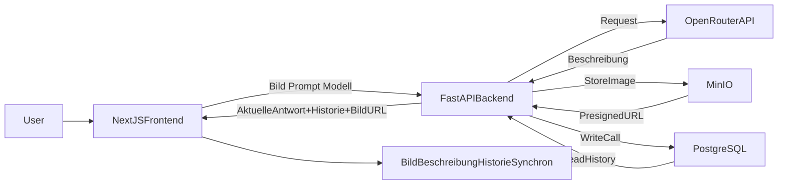

# PLAN.md - ArchitekturBild MVP

## Ziel
Den in `AGENTS.md` definierten Scope als lokal lauffaehige Anwendung liefern, bei der Bild, Prompt, Modellauswahl und LLM-Beschreibung synchron sind, alle LLM-Calls historisiert werden, Metadaten in PostgreSQL persistent gespeichert sind und Bilder in MinIO gespeichert/ueber Presigned URLs ausgeliefert werden.

## Referenzen
- Anforderungen: [`AGENTS.md`](../AGENTS.md)
- Ziel-Dokument: [`docs/PLAN.md`](./PLAN.md)

## Fortschritt
- [x] AP1 - Projektgrundlage und Struktur
- [x] AP2 - Backend-MVP (FastAPI + OpenRouter)
- [x] AP3 - Frontend-MVP (Upload, Prompt, Modell, Ausgabe)
- [x] AP4 - End-to-End-Integration und Zustandslogik
- [x] AP5 - UI-Styling gemaess Farbkonzept
- [x] AP6 - Skripte und lokaler Betrieb (Mac)
- [x] AP7 - Qualitaetssicherung und MVP-Abnahme
- [x] AP8 - Persistenzschicht mit PostgreSQL
- [x] AP9 - Historienfunktion im Frontend
- [x] AP10 - QA-Erweiterung fuer Persistenz und Historie
- [x] AP11 - MinIO-Integration im Backend
- [x] AP12 - History-API mit Presigned URLs
- [x] AP13 - Historienlayout Bild links, Text rechts
- [x] AP14 - QA-Erweiterung fuer MinIO und Layout

## Arbeitspakete

### AP1 - Projektgrundlage und Struktur
**Ziel:** Saubere Projektbasis fuer lokale Entwicklung und spaetere Umsetzung der Features.

**Deliverables (Checkliste):**
- [x] Verzeichnis `docs/` ist angelegt.
- [x] Datei `docs/PLAN.md` ist angelegt und beinhaltet den abgestimmten Plan.
- [x] Grundstruktur fuer `frontend/`, `backend/`, `scripts/` ist dokumentiert (falls fehlend, angelegt).
- [x] Kurze lokale Setup-Notiz (Startvoraussetzungen, `.env`-Hinweis) ist vorhanden.

**Setup-Notiz (lokal):**
- Voraussetzungen: Aktuelles Node.js (fuer NextJS) und Python (fuer FastAPI) lokal installiert.
- Konfiguration: Root-`.env` muss `OPENROUTER_API_KEY` enthalten.
- Startpunkt: Skripte fuer den lokalen Start/Stopp werden in AP6 unter `scripts/` finalisiert.

**Strukturstatus (Basis):**
- `frontend/` (angelegt)
- `backend/` (vorhanden)
- `scripts/` (vorhanden)
- `docs/` (angelegt)

### AP2 - Backend-MVP (FastAPI + OpenRouter)
**Ziel:** API bereitstellen, die Bild + Prompt + Modell entgegennimmt und eine Beschreibung vom LLM liefert.

**Deliverables (Checkliste):**
- [x] FastAPI-App laeuft lokal stabil.
- [x] Endpoint fuer Bildanalyse ist implementiert (Input: Bild + System-Prompt + Modell).
- [x] OpenRouter-Integration nutzt `OPENROUTER_API_KEY` aus Root-`.env`.
- [x] Fehlerfaelle sind fuer MVP sinnvoll behandelt (z. B. kein API-Key, ungueltiges Bild, API-Fehler).
- [x] Antwortschema ist klar und vom Frontend direkt nutzbar.

### AP3 - Frontend-MVP (Upload, Prompt, Modell, Ausgabe)
**Ziel:** Benutzeroberflaeche liefert alle geforderten Interaktionen inkl. synchroner Aktualisierung.

**Deliverables (Checkliste):**
- [x] Bild-Upload/Anzeige funktioniert.
- [x] Prompt wird ueber Bild und Beschreibung angezeigt.
- [x] Prompt ist editierbar und per Button speicherbar.
- [x] Modell ist per Dropdown auswaehlbar.
- [x] LLM-Aufruf wird automatisch getriggert bei:
  - [x] neuem Bild
  - [x] gespeichertem Prompt
  - [x] geaenderter Modellauswahl
- [x] Ausgabe-Text wird rechts neben dem Bild angezeigt.
- [x] Bild und Beschreibung bleiben logisch synchron (neueste Eingabe -> neueste Ausgabe).

### AP4 - End-to-End-Integration und Zustandslogik
**Ziel:** Robustes Zusammenspiel von Frontend und Backend inklusive klarer Zustandslogik.

**Deliverables (Checkliste):**
- [x] API-Client im Frontend ist integriert und getestet.
- [x] Lade-/Fehlerzustaende sind sichtbar und verstaendlich.
- [x] Race-Conditions bei schnellen Aenderungen sind minimiert (nur letzter Request zaehlt).
- [x] Last-Write-Wins-Verhalten ist fuer die aktuelle Ausgabe stabil umgesetzt.

### AP5 - UI-Styling gemaess Farbkonzept
**Ziel:** Konsistentes Erscheinungsbild nach vorgegebenem Farbschema.

**Deliverables (Checkliste):**
- [x] Farben `#ecad0a`, `#209dd7`, `#753991`, `#032147`, `#888888` sind im UI sinnvoll verwendet.
- [x] Typische UI-Bereiche (Heading, CTA, Links, Begleittext) folgen der definierten Zuordnung.
- [x] Layout bleibt auch bei laengerer Modellantwort lesbar.

### AP6 - Skripte und lokaler Betrieb (Mac)
**Ziel:** Anwendung mit einfachen Skripten start-/stoppbar machen.

**Deliverables (Checkliste):**
- [x] Startskript in `scripts/` startet Backend und Frontend fuer lokale Nutzung.
- [x] Stoppskript in `scripts/` beendet die Prozesse zuverlaessig.
- [x] Kurzer Ablauf fuer lokale Inbetriebnahme ist dokumentiert.

### AP7 - Qualitaetssicherung und MVP-Abnahme
**Ziel:** Nachweis, dass alle Anforderungen aus `AGENTS.md` erfuellt sind.

**Deliverables (Checkliste):**
- [x] Manuelle Test-Checkliste pro Kernfunktion ist erstellt und abgearbeitet.
- [x] Positive Flows getestet (Upload, Prompt-Aenderung, Modellwechsel).
- [x] Relevante Fehlerfaelle getestet (fehlender Key, API-Fehler, ungueltige Datei).
- [x] Abgleich mit allen Business Requirements in `AGENTS.md` ist dokumentiert.

### AP8 - Persistenzschicht mit PostgreSQL
**Ziel:** LLM-Calls dauerhaft speichern und nach Backend-Neustart wieder verfuegbar machen.

**Deliverables (Checkliste):**
- [x] PostgreSQL ist als lokale Datenbank eingebunden und erreichbar.
- [x] Datenbankschema fuer LLM-Calls ist definiert (Bildmetadaten, Prompt, Modell, Antwort, Zeitstempel).
- [x] Jeder erfolgreiche Analyze-Call wird persistent gespeichert.
- [ ] Optional: Fehlerhafte Calls werden mit Status/Fallback nachvollziehbar abgelegt (falls vorgesehen).
- [x] Backend bietet einen Read-Endpoint fuer die Historie in absteigend chronologischer Reihenfolge.
**Statushinweis:** End-to-End verifiziert (Analyze speichern, History lesen, Persistenz nach Backend-Neustart).

### AP9 - Historienfunktion im Frontend
**Ziel:** Alle bisherigen LLM-Calls unterhalb des aktuellen Calls im selben Design darstellen (neueste oben).

**Deliverables (Checkliste):**
- [x] Frontend laedt die Historie beim Start und zeigt sie unterhalb des aktuellen Ergebnisses an.
- [x] Historienelemente nutzen dasselbe Grundlayout wie der aktuelle Call.
- [x] Sortierung ist korrekt: neueste Eintraege oben.
- [x] Nach neuem Analyze-Call wird die Historie sofort aktualisiert.
- [x] Historieneintraege enthalten mindestens Bildbezug, Prompt, Modell, Beschreibung und Zeitpunkt.

### AP10 - QA-Erweiterung fuer Persistenz und Historie
**Ziel:** Nachweis, dass Persistenz und Historienanzeige stabil funktionieren.

**Deliverables (Checkliste):**
- [x] Testfall: Analyze-Call erzeugen, Backend neustarten, Historie weiterhin vorhanden.
- [x] Testfall: Mehrere Calls, Reihenfolge in UI korrekt (neueste oben).
- [x] Testfall: Historie und aktueller Call visuell konsistent.
- [x] Testfall: API/DB-Fehlerpfade fuer Historienladevorgang dokumentiert.
- [x] QA-Report in `docs/QA_REPORT.md` um die neuen Anforderungen erweitert.

### AP11 - MinIO-Integration im Backend
**Ziel:** Jedes neu hochgeladene Bild wird bei erfolgreichem Analyze-Flow in MinIO gespeichert.

**Deliverables (Checkliste):**
- [x] MinIO-Client im Backend integriert (Konfiguration ueber `.env`).
- [x] Upload-Logik in `/api/analyze` mit deterministischem Objekt-Key umgesetzt.
- [x] Fehlerbehandlung: MinIO-Upload-Fehler fuehren zu klarer API-Fehlermeldung.
- [x] Start-/Run-Doku um MinIO-Env-Variablen erweitert.

### AP12 - History-API mit Presigned URLs
**Ziel:** Historieneintraege liefern pro Bild eine Presigned URL.

**Deliverables (Checkliste):**
- [x] DB-Schema erweitert um `storage_bucket` und `storage_object_key`.
- [x] Persistenz schreibt Objektreferenzen je Call in PostgreSQL.
- [x] `/api/history` liefert `image_url` per Presigned URL.
- [x] Backward-Compatibility fuer alte Datensaetze ohne Objekt-Key umgesetzt (Fallback auf kein Bild).

### AP13 - Historienlayout Bild links, Text rechts
**Ziel:** Historienzeilen zeigen links Bild und rechts Modell, Dateiname, Prompt, Beschreibung.

**Deliverables (Checkliste):**
- [x] 2-Spalten-Layout pro Historieneintrag umgesetzt.
- [x] Textblock enthaelt Modell, Dateiname, Prompt, Beschreibung.
- [x] Fallback bei fehlender/abgelaufener URL umgesetzt.
- [x] Responsives Verhalten fuer kleine Screens umgesetzt.

### AP14 - QA-Erweiterung fuer MinIO und Layout
**Ziel:** Nachweis, dass Storage, URL-Erzeugung und UI-Layout stabil funktionieren.

**Deliverables (Checkliste):**
- [x] Test: Analyze erzeugt DB-Eintrag + MinIO-Objekt.
- [x] Test: `/api/history` liefert gueltige Presigned URL.
- [x] Test: Historie zeigt links Bild, rechts Modell/Dateiname/Prompt/Beschreibung.
- [x] Test: Nach Backend-Neustart bleiben Eintraege sichtbar; URLs werden neu signiert.
- [x] Fehlerfall-Test: MinIO nicht erreichbar -> klare Backend-Fehlermeldung.
- [x] `docs/QA_REPORT.md` um MinIO-/Layout-Tests erweitert.

## Umsetzungsreihenfolge
1. AP1 Projektgrundlage
2. AP2 Backend-MVP
3. AP3 Frontend-MVP
4. AP4 Integration/Zustandslogik
5. AP5 Styling
6. AP6 Skripte
7. AP7 QA und Abnahme
8. AP8 Persistenz mit PostgreSQL
9. AP9 Historie im Frontend
10. AP10 QA-Erweiterung
11. AP11 MinIO-Integration
12. AP12 Presigned URLs
13. AP13 Historienlayout
14. AP14 QA MinIO/Layout

## Architektur-Uebersicht (MVP)

## Abnahmekriterien (kompakt)
- Alle in `AGENTS.md` genannten Funktionen sind vorhanden und nachvollziehbar testbar.
- Lokaler Betrieb funktioniert; optionale Docker-Nutzung fuer MinIO wird unterstuetzt.
- LLM-Calls sind persistent gespeichert und nach Backend-Neustart wieder abrufbar.
- Alle neuen Bild-Uploads werden in MinIO gespeichert und in der Historie nach Neustart sichtbar angezeigt.
